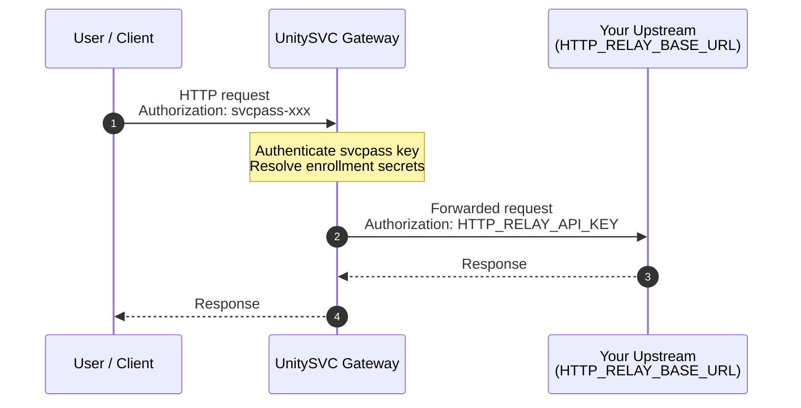

## HTTP Relay — Bring Your Own Endpoint

Route HTTP requests through the UnitySVC gateway using your own upstream HTTP endpoint and optional API key.

### Request Flow

### Setup

1. **Enroll** in this service on the UnitySVC platform
2. **Provide your endpoint credentials** as customer secrets during enrollment:
   - `HTTP_RELAY_BASE_URL` — your upstream HTTP base URL (e.g., `https://api.example.com`)
   - `HTTP_RELAY_API_KEY` — your upstream API key (optional, leave empty if not needed)

3. **Send requests** through the UnitySVC HTTP gateway using your svcpass API key

### svcpass handling — `HTTP_RELAY_API_KEY` dispositions

Your svcpass key authenticates you to the gateway. What the gateway sends to your upstream is controlled by the value of your `HTTP_RELAY_API_KEY` customer secret — four dispositions are recognized (see [unitysvc#1198](https://github.com/unitysvc/unitysvc/issues/1198)):

| `HTTP_RELAY_API_KEY` value | Behavior | When to use |
|---|---|---|
| **unset / empty** | **strip** — gateway removes the svcpass-bearing header and injects nothing | Public upstream, or you authenticate via a *different* header (see "Header co-existence" below) |
| `__strip__` | **strip** (explicit synonym of the unset default) | Same as unset, but makes the intent visible in your enrollment |
| `__forward__` | **forward** — gateway passes your svcpass token through to the upstream untouched on its original header | Only valid when `HTTP_RELAY_BASE_URL` is a trusted (svcpass-aware) host. Rejected at validate-time for arbitrary external hosts — svcpass is a platform credential and the platform refuses to leak it to untrusted upstreams |
| _any other literal_ | **override** — gateway removes svcpass and injects this value on the **same header** your client used | Default for normal upstreams that have their own API key. Header is `Authorization` (scheme `Bearer`) if you sent svcpass on `Authorization`, otherwise the raw value on `x-api-key` / `x-goog-api-key` |

The sentinels (`__strip__`, `__forward__`) are matched as authored literals after customer-secret resolution. If you set `HTTP_RELAY_API_KEY` to either reserved token, the gateway treats it as the disposition, not as a credential — don't use them as real upstream keys.

#### Header co-existence

A non-svcpass token you send on a *different* recognized header (`Authorization`, `x-api-key`, or `x-goog-api-key`) passes through to your upstream **untouched**. If your upstream takes its credential on a different header than where you placed svcpass, the two tokens co-exist — `__strip__` plus an inline upstream credential on a side-channel header is the canonical way to authenticate to your upstream without storing the key on UnitySVC at all.

### Usage

Configure your HTTP client with:
- **Gateway URL**: `SERVICE_BASE_URL` (provided on enrollment)
- **Auth**: HTTP Basic Auth — username is the routing key, password is your svcpass API key

The gateway authenticates you, resolves your upstream endpoint from your enrollment secrets, and proxies the request.

### Supported Upstream Providers

Any HTTP/HTTPS endpoint works. Common use cases:
- **REST APIs**: any JSON or REST API behind your own auth
- **Internal services**: expose internal services through the gateway
- **Third-party APIs**: proxy requests to OpenAI, Stripe, etc. with your own keys
