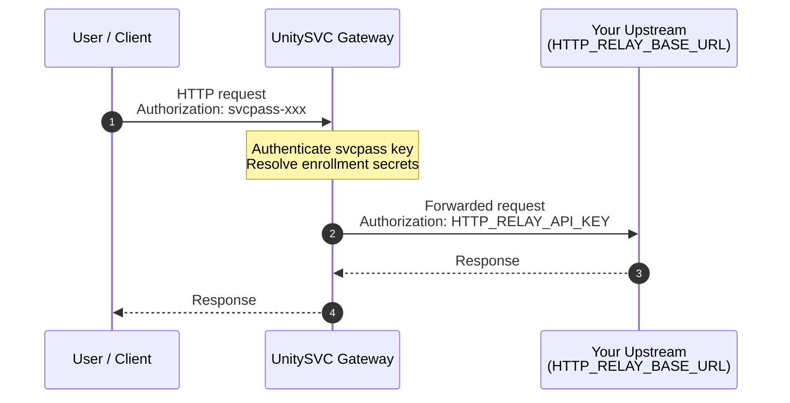

## HTTP Relay — Bring Your Own Endpoint

Route HTTP requests through the UnitySVC gateway using your own upstream HTTP endpoint and optional API key.

### Request Flow

### Setup

1. **Enroll** in this service on the UnitySVC platform
2. **Provide your endpoint credentials** as customer secrets during enrollment:
   - `HTTP_RELAY_BASE_URL` — your upstream HTTP base URL (e.g., `https://api.example.com`)
   - `HTTP_RELAY_API_KEY` — your upstream API key (optional, leave empty if not needed)

3. **Send requests** through the UnitySVC HTTP gateway using your svcpass API key

### Usage

Configure your HTTP client with:
- **Gateway URL**: `SERVICE_BASE_URL` (provided on enrollment)
- **Auth**: HTTP Basic Auth — username is the routing key, password is your svcpass API key

The gateway authenticates you, resolves your upstream endpoint from your enrollment secrets, and proxies the request.

### Supported Upstream Providers

Any HTTP/HTTPS endpoint works. Common use cases:
- **REST APIs**: any JSON or REST API behind your own auth
- **Internal services**: expose internal services through the gateway
- **Third-party APIs**: proxy requests to OpenAI, Stripe, etc. with your own keys
