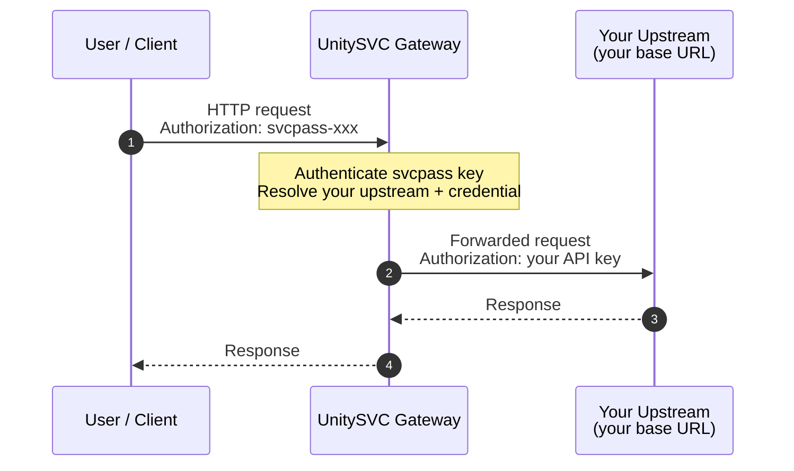

## HTTP Relay

Route HTTP requests through the UnitySVC gateway to **your own** upstream HTTP endpoint. You bring the endpoint (and, if needed, its API key); the gateway authenticates you with your svcpass key, resolves which upstream to forward to, swaps in your upstream credential, and proxies the request.

### How it works



The only thing that changes between the two usage methods below is **where the gateway gets your upstream endpoint and key from** — a stored secret, or a per-enrollment parameter. Everything else (authentication, credential handling, proxying) is identical.

### Two ways to use this service

This service exposes two **upstream access channels**. Pick whichever fits — you can use both.

| | `byok` — stored endpoint | `plus` — per-enrollment endpoints |
|---|---|---|
| Best for | one fixed upstream | many upstreams under one account |
| Endpoint | `HTTP_RELAY_BASE_URL` customer secret | a `base_url` parameter per enrollment |
| API key | `HTTP_RELAY_API_KEY` customer secret | the secret named by the `api_key_secret` parameter |
| Reached at | the canonical gateway URL | a unique `/e/<code>` URL per enrollment |
| Price | **free** | **$0.0001 / request** |

#### Method 1 — Stored endpoint (`byok`, free)

One upstream, configured once via customer secrets.

1. **Provide your endpoint credentials** as customer secrets:
   - `HTTP_RELAY_BASE_URL` — your upstream HTTP base URL (e.g. `https://api.example.com`)
   - `HTTP_RELAY_API_KEY` — your upstream API key (optional; leave empty if not needed)
2. **Send requests** to the canonical gateway URL using your svcpass API key. The gateway resolves your upstream from the stored secrets and proxies the request.

#### Method 2 — Per-enrollment endpoints (`plus`, metered)

Run **multiple** relays under one account — each enrollment routes to a different upstream. Useful for:

- **Dev + Prod**: one enrollment for staging, another for production
- **Multi-tenant**: a different upstream per client or project
- **Multiple providers**: separate enrollments for different third-party APIs

Each enrollment routes to one upstream `base_url`, which you set **directly** as a parameter (e.g. `https://api.example.com`) — the base URL is not sensitive, and seeing it plainly makes enrollments easy to tell apart. The API key is supplied separately through `api_key_secret` (a customer-secret *name*), never inline.

1. **(Optional) Create a customer secret** for each upstream API key, using a naming convention:

   ```
   STAGING_API_KEY = sk-staging-xxxxx
   PROD_API_KEY    = sk-prod-xxxxx
   ```

2. **Enroll once per endpoint**, providing the parameters:

   | | `base_url` | `api_key_secret` |
   |---|---|---|
   | staging | `https://api.staging.example.com` | `STAGING_API_KEY` |
   | production | `https://api.example.com` | `PROD_API_KEY` |

3. **Send requests** to each enrollment's unique `/e/<code>` gateway URL using your svcpass API key.

### svcpass handling — upstream API-key dispositions

Your svcpass key authenticates you to the *gateway*. What the gateway sends to **your upstream** is controlled by the **value** of your upstream API-key secret — `HTTP_RELAY_API_KEY` for Method 1, or the secret named by `api_key_secret` for Method 2 (per-enrollment, so a dev enrollment can strip while a prod enrollment overrides). Four dispositions are recognized (see [unitysvc#1198](https://github.com/unitysvc/unitysvc/issues/1198)):

| Secret value | Behavior | When to use |
|---|---|---|
| **unset / empty** | **strip** — gateway removes the svcpass-bearing header and injects nothing | Public upstream, or you authenticate via a *different* header (see "Header co-existence" below) |
| `__strip__` | **strip** (explicit synonym of the unset default) | Same as unset, but makes the intent visible in your enrollment |
| `__forward__` | **forward** — gateway passes your svcpass token through to the upstream untouched on its original header | Only valid when your `base_url` is a trusted (svcpass-aware) host. Rejected at validate-time for arbitrary external hosts — svcpass is a platform credential and the platform refuses to leak it to untrusted upstreams |
| _any other literal_ (e.g. `sk-prod-xxxxx`) | **override** — gateway removes svcpass and injects this value on the **same header** your client used | Default for normal upstreams that have their own API key. Header is `Authorization` (scheme `Bearer`) if you sent svcpass on `Authorization`, otherwise the raw value on `x-api-key` / `x-goog-api-key` |

The sentinels (`__strip__`, `__forward__`) are matched as authored literals after customer-secret resolution. If you set a secret to either reserved token, the gateway treats it as the disposition, not as a credential — don't use them as real upstream keys.

#### Header co-existence

A non-svcpass token you send on a *different* recognized header (`Authorization`, `x-api-key`, or `x-goog-api-key`) passes through to your upstream **untouched**. If your upstream takes its credential on a different header than where you placed svcpass, the two tokens co-exist — `__strip__` plus an inline upstream credential on a side-channel header is the canonical way to authenticate to your upstream without storing the key on UnitySVC at all.

### Supported upstreams

Any HTTP/HTTPS endpoint works. Common use cases:

- **REST APIs** — any JSON or REST API behind your own auth
- **Internal services** — expose internal services through the gateway
- **Third-party APIs** — proxy requests to OpenAI, Stripe, etc. with your own keys
